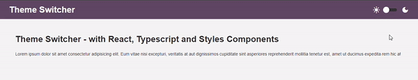

## Theme Switcher 🌝➡🌚

Este projeto implementa uma interface web muito simples, para alternar entre os temas light e dark, acionando reativamente a alteração do esquema de cores (backgrounds e textos).

	

### Tecnologias aplicadas

- Typescript - para inclusão de tipagens nos componentes
- ReactJS - criação e gerenciamento da DOM
- Library Styled Components - aplicação de estilos com vantagens do SCSS

### Recursos aplicados

- Context API do React
- Local Storage do navegador
- React Hook personalizado
- CSS (Flex Layout)
